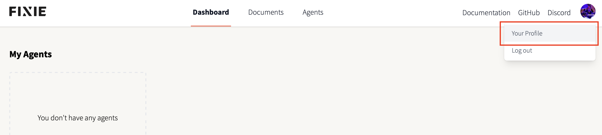

# Quickstart: Fixie Sidekicks

[Quickstart: Fixie Sidekicks | AI.JSX](https://docs.ai-jsx.com/sidekicks/sidekicks-quickstart)

# Step 0: Prerequisites

## Get a Fixie Developer account

In your web browser, navigate to [Fixie](https://console.fixie.ai/) to sign in or create your free account.

Click on your user avatar in the upper-right and select _Your Profile_:



This is where you will find your API token that we’ll need later in this guide:


## Install Node.js

If you don’t have the latest LTS version of Node.js installed, please go to [https://nodejs.org/en](https://nodejs.org/en) to download and install that on your local machine.

[Node.js](https://nodejs.org/en)

As of this writing - on Saturday, September 30th, 2023 - the latest LTS version is currently 18.18.0.

## Install the Fixie CLI

With the latest version of Node.js installed on your system, it’s time to install the Fixie CLI:

```bash
# Make sure we're in the right directory for our example
cd quickstart-fixie-sidekicks

# Install the Fixie CLI
% npx fixie@latest
```

## Authenticate the Fixie CLI

Let’s use the Fixie CLI to login to the Fixie service and work with our account:

```bash
# Open a browser tab to authenticate using the Fixie Console
% npx fixie@latest auth
🔑 Your browser has been opened to visit:

   https://api.fixie.ai/authorize?client_id=II4FM6ToxVwSKB6DW1r114AKAuSnuZEgYehEBB-5WQA&scope=api-access&state=ruEDdwbs00VMUgIGJN_BzA&redirect_uri=httplocalhost54902&response_type=code

🎉 Successfully logged into https://api.fixie.ai as rob
👤 You are logged into https://api.fixie.ai as rob
🔑 Your FIXIE_API_KEY is: eyJhbGciOiJI...
```

# Step 1: Clone Sidekick Template Repo

```bash
# Clone the Sidekick Template repo
% git clone https://github.com/fixie-ai/fixie-sidekick-template.git
```

# Step 2: Build the Sidekick Code

The Fixie Sidekick Template repo is implemented in TypeScript and not native JavaScript, so we must build it before it can be deployed:

```bash
# Make sure we're in the appropriate directory
% cd fixie-sidekick-template

# Install our dependencies
% npm install

# Build our project
% npm run build
```

This will build the JavaScript necessary for deployment in the `dist` subdirectory.

# Step 3: Deploy the Sidekick

It’s time to deploy our Sidekick. Make sure you’re in the appropriate directory. This may take a few minutes, but once it has been deployed you will see a link to the Sidekick’s page on the Fixie Console:

```bash
# Make sure we're in the appropriate directory
% cd fixie-sidekick-template

# Deploy the Sidekick to Fixie
% npx fixie@latest deploy
🦊 Deploying agent rob/fixie-sidekick-template...
🦊 Creating new agent rob/fixie-sidekick-template...
npm notice
npm notice 📦  fixie-sidekick-template@0.1.0
npm notice === Tarball Contents ===
npm notice 1.1kB LICENSE
npm notice 512B  README.md
npm notice 86B   dist/index.d.ts
npm notice 2.0kB dist/index.js
npm notice 192B  dist/system-message.d.ts
npm notice 4.1kB dist/system-message.js
npm notice 639B  package.json
npm notice === Tarball Details ===
npm notice name:          fixie-sidekick-template
npm notice version:       0.1.0
npm notice filename:      fixie-sidekick-template-0.1.0.tgz
npm notice package size:  3.8 kB
npm notice unpacked size: 8.6 kB
npm notice shasum:        d68b333e0a107beb61c49160bcecf12edb0be0c4
npm notice integrity:     sha512-splU+Mrrbo2g6[...]zhbWHNjzPbp6Q==
npm notice total files:   7
npm notice
fixie-sidekick-template-0.1.0.tgz
⠋  🚀 Deploying... (hang tight, this takes a minute or two!)(node:25200) ExperimentalWarning: buffer.File is an experimental feature and might change at any time
(Use `node --trace-warnings ...` to show where the warning was created)
✔ Agent fixie-sidekick-template is running at: https://console.fixie.ai/agents/rob/fixie-sidekick-template
```

# Step 4: Converse with Sidekick

Time to chat with our Sidekick. In the above example, we see that our Agent is running at [https://console.fixie.ai/agents/rob/fixie-sidekick-template](https://console.fixie.ai/agents/rob/fixie-sidekick-template)


## Example prompt

Let’s try an example prompt to see our Sidekick in action - `What can you tell me about foxes?`


# Local Development and Testing

As you saw, deploying the Sidekick to the cloud may take a few minutes. Instead of running `fixie deploy` we can run our Sidekick locally with:

```bash
# Make sure we're in the appropriate directory
% cd fixie-sidekick-template

# Run our Sidekick locally
% npx fixie@latest serve
🦊 Serving agent rob/fixie-sidekick-template...
🌱 Building agent at /Users/rob/repos/explore-fixie-ai/quickstart-fixie-sidekicks/fixie-sidekick-template...
npm notice
npm notice 📦  fixie-sidekick-template@0.1.0
npm notice === Tarball Contents ===
npm notice 1.1kB LICENSE
npm notice 512B  README.md
npm notice 86B   dist/index.d.ts
npm notice 2.0kB dist/index.js
npm notice 192B  dist/system-message.d.ts
npm notice 4.1kB dist/system-message.js
npm notice 639B  package.json
npm notice === Tarball Details ===
npm notice name:          fixie-sidekick-template
npm notice version:       0.1.0
npm notice filename:      fixie-sidekick-template-0.1.0.tgz
npm notice package size:  3.8 kB
npm notice unpacked size: 8.6 kB
npm notice shasum:        d68b333e0a107beb61c49160bcecf12edb0be0c4
npm notice integrity:     sha512-splU+Mrrbo2g6[...]zhbWHNjzPbp6Q==
npm notice total files:   7
npm notice
fixie-sidekick-template-0.1.0.tgz
🌱 Running: npx --package=@fixieai/sdk fixie-serve-bin --packagePath ./dist/index.js --port 8181
🌱 Agent process running at PID: 26336
🌱 Watching /Users/rob/repos/explore-fixie-ai/quickstart-fixie-sidekicks/fixie-sidekick-template for changes...
🌱 Agent child process started with PID [26336]
🥡 Replacing current agent revision d13ac012
🚇 Starting tunnel process...
🌱 Agent stdout: AI.JSX agent listening on http://0.0.0.0:8181.
🚇 Current tunnel URL is: https://dba3ebc4c2fcb2.lhr.life
🥡 Created temporary agent revision 7947334d
🥡 Agent fixie-sidekick-template is running at: https://console.fixie.ai/agents/rob/fixie-sidekick-template
```

This setup a tunnel to your locally running Sidekick for your Fixie service. Once this command is quit (for example, by hitting CTRL+C) the Sidekick will revert back to the most recently deployed version.

**IMPORTANT: Don’t forget to deploy your latest Sidekick if you’ve made any changes 🤓**

# Sending Messages to your Sidekick

## Method 1: Via the REST API (using curl)

Let’s use `curl` on our command-line to ask our Sidekick a question:

```bash
# Example curl request to our REST API
curl 'https://api.fixie.ai/api/v1/agents/<your user name>/<your sidekick name>/conversations' \
  -d '{ "message": "Tell me about yourself" }' \
  -H 'Authorization: Bearer <your Fixie API key>' \
  -H 'Content-Type: application/json'
```

```bash
# Let's interact with the demo Sidekick created in this guide
% curl 'https://api.fixie.ai/api/v1/agents/rob/fixie-sidekick-template/conversations' \
  -d '{ "message": "Tell me about yourself" }' \
  -H 'Authorization: Bearer <your Fixie API key>' \
  -H 'Content-Type: application/json'
```

This will show a stream of response messages from the Sidekick as it sends back a response to your question - “Tell me about yourself”

```bash
{"id": "eae28052-9c40-4808-b6cd-57e46c9584da", "turns": [{"id": "4d167c71-16bb-4442-ba27-3f292f11b5e8", "timestamp": "2023-09-30T19:37:15.086123+00:00", "role": "user", "messages": [{"kind": "text", "content": "Tell me about yourself"}], "generationParams": null, "state": "done"}, {"id": "9050f798-6f4c-4617-930d-e19c9c70fc42", "timestamp": "2023-09-30T19:37:15.093374+00:00", "role": "assistant", "messages": [], "generationParams": null, "state": "in-progress", "inReplyToId": "4d167c71-16bb-4442-ba27-3f292f11b5e8"}]}
{"id": "eae28052-9c40-4808-b6cd-57e46c9584da", "turns": [{"id": "4d167c71-16bb-4442-ba27-3f292f11b5e8", "timestamp": "2023-09-30T19:37:15.086123+00:00", "role": "user", "messages": [{"kind": "text", "content": "Tell me about yourself"}], "generationParams": null, "state": "done"}, {"id": "9050f798-6f4c-4617-930d-e19c9c70fc42", "timestamp": "2023-09-30T19:37:15.093374+00:00", "role": "assistant", "messages": [], "generationParams": null, "state": "in-progress", "inReplyToId": "4d167c71-16bb-4442-ba27-3f292f11b5e8"}]}
{"id": "eae28052-9c40-4808-b6cd-57e46c9584da", "turns": [{"id": "4d167c71-16bb-4442-ba27-3f292f11b5e8", "timestamp": "2023-09-30T19:37:15.086123+00:00", "role": "user", "messages": [{"kind": "text", "content": "Tell me about yourself"}], "generationParams": null, "state": "done"}, {"id": "9050f798-6f4c-4617-930d-e19c9c70fc42", "timestamp": "2023-09-30T19:37:15.093374+00:00", "role": "assistant", "messages": [], "generationParams": null, "state": "in-progress", "inReplyToId": "4d167c71-16bb-4442-ba27-3f292f11b5e8"}]}
{"id": "eae28052-9c40-4808-b6cd-57e46c9584da", "turns": [{"id": "4d167c71-16bb-4442-ba27-3f292f11b5e8", "timestamp": "2023-09-30T19:37:15.086123+00:00", "role": "user", "messages": [{"kind": "text", "content": "Tell me about yourself"}], "generationParams": null, "state": "done"}, {"id": "9050f798-6f4c-4617-930d-e19c9c70fc42", "timestamp": "2023-09-30T19:37:15.093374+00:00", "role": "assistant", "messages": [{"kind": "text", "content": " "}], "generationParams": null, "state": "in-progress", "inReplyToId": "4d167c71-16bb-4442-ba27-3f292f11b5e8"}]}
{"id": "eae28052-9c40-4808-b6cd-57e46c9584da", "turns": [{"id": "4d167c71-16bb-4442-ba27-3f292f11b5e8", "timestamp": "2023-09-30T19:37:15.086123+00:00", "role": "user", "messages": [{"kind": "text", "content": "Tell me about yourself"}], "generationParams": null, "state": "done"}, {"id": "9050f798-6f4c-4617-930d-e19c9c70fc42", "timestamp": "2023-09-30T19:37:15.093374+00:00", "role": "assistant", "messages": [{"kind": "text", "content": ""}], "generationParams": null, "state": "in-progress", "inReplyToId": "4d167c71-16bb-4442-ba27-3f292f11b5e8"}]}
{"id": "eae28052-9c40-4808-b6cd-57e46c9584da", "turns": [{"id": "4d167c71-16bb-4442-ba27-3f292f11b5e8", "timestamp": "2023-09-30T19:37:15.086123+00:00", "role": "user", "messages": [{"kind": "text", "content": "Tell me about yourself"}], "generationParams": null, "state": "done"}, {"id": "9050f798-6f4c-4617-930d-e19c9c70fc42", "timestamp": "2023-09-30T19:37:15.093374+00:00", "role": "assistant", "messages": [{"kind": "text", "content": "I"}], "generationParams": null, "state": "in-progress", "inReplyToId": "4d167c71-16bb-4442-ba27-3f292f11b5e8"}]}
{"id": "eae28052-9c40-4808-b6cd-57e46c9584da", "turns": [{"id": "4d167c71-16bb-4442-ba27-3f292f11b5e8", "timestamp": "2023-09-30T19:37:15.086123+00:00", "role": "user", "messages": [{"kind": "text", "content": "Tell me about yourself"}], "generationParams": null, "state": "done"}, {"id": "9050f798-6f4c-4617-930d-e19c9c70fc42", "timestamp": "2023-09-30T19:37:15.093374+00:00", "role": "assistant", "messages": [{"kind": "text", "content": "I'm"}], "generationParams": null, "state": "in-progress", "inReplyToId": "4d167c71-16bb-4442-ba27-3f292f11b5e8"}]}
{"id": "eae28052-9c40-4808-b6cd-57e46c9584da", "turns": [{"id": "4d167c71-16bb-4442-ba27-3f292f11b5e8", "timestamp": "2023-09-30T19:37:15.086123+00:00", "role": "user", "messages": [{"kind": "text", "content": "Tell me about yourself"}], "generationParams": null, "state": "done"}, {"id": "9050f798-6f4c-4617-930d-e19c9c70fc42", "timestamp": "2023-09-30T19:37:15.093374+00:00", "role": "assistant", "messages": [{"kind": "text", "content": "I'm an"}], "generationParams": null, "state": "in-progress", "inReplyToId": "4d167c71-16bb-4442-ba27-3f292f11b5e8"}]}
{"id": "eae28052-9c40-4808-b6cd-57e46c9584da", "turns": [{"id": "4d167c71-16bb-4442-ba27-3f292f11b5e8", "timestamp": "2023-09-30T19:37:15.086123+00:00", "role": "user", "messages": [{"kind": "text", "content": "Tell me about yourself"}], "generationParams": null, "state": "done"}, {"id": "9050f798-6f4c-4617-930d-e19c9c70fc42", "timestamp": "2023-09-30T19:37:15.093374+00:00", "role": "assistant", "messages": [{"kind": "text", "content": "I'm an AI"}], "generationParams": null, "state": "in-progress", "inReplyToId": "4d167c71-16bb-4442-ba27-3f292f11b5e8"}]}
{"id": "eae28052-9c40-4808-b6cd-57e46c9584da", "turns": [{"id": "4d167c71-16bb-4442-ba27-3f292f11b5e8", "timestamp": "2023-09-30T19:37:15.086123+00:00", "role": "user", "messages": [{"kind": "text", "content": "Tell me about yourself"}], "generationParams": null, "state": "done"}, {"id": "9050f798-6f4c-4617-930d-e19c9c70fc42", "timestamp": "2023-09-30T19:37:15.093374+00:00", "role": "assistant", "messages": [{"kind": "text", "content": "I'm an AI assistant"}], "generationParams": null, "state": "in-progress", "inReplyToId": "4d167c71-16bb-4442-ba27-3f292f11b5e8"}]}
{"id": "eae28052-9c40-4808-b6cd-57e46c9584da", "turns": [{"id": "4d167c71-16bb-4442-ba27-3f292f11b5e8", "timestamp": "2023-09-30T19:37:15.086123+00:00", "role": "user", "messages": [{"kind": "text", "content": "Tell me about yourself"}], "generationParams": null, "state": "done"}, {"id": "9050f798-6f4c-4617-930d-e19c9c70fc42", "timestamp": "2023-09-30T19:37:15.093374+00:00", "role": "assistant", "messages": [{"kind": "text", "content": "I'm an AI assistant designed"}], "generationParams": null, "state": "in-progress", "inReplyToId": "4d167c71-16bb-4442-ba27-3f292f11b5e8"}]}
{"id": "eae28052-9c40-4808-b6cd-57e46c9584da", "turns": [{"id": "4d167c71-16bb-4442-ba27-3f292f11b5e8", "timestamp": "2023-09-30T19:37:15.086123+00:00", "role": "user", "messages": [{"kind": "text", "content": "Tell me about yourself"}], "generationParams": null, "state": "done"}, {"id": "9050f798-6f4c-4617-930d-e19c9c70fc42", "timestamp": "2023-09-30T19:37:15.093374+00:00", "role": "assistant", "messages": [{"kind": "text", "content": "I'm an AI assistant designed to"}], "generationParams": null, "state": "in-progress", "inReplyToId": "4d167c71-16bb-4442-ba27-3f292f11b5e8"}]}
{"id": "eae28052-9c40-4808-b6cd-57e46c9584da", "turns": [{"id": "4d167c71-16bb-4442-ba27-3f292f11b5e8", "timestamp": "2023-09-30T19:37:15.086123+00:00", "role": "user", "messages": [{"kind": "text", "content": "Tell me about yourself"}], "generationParams": null, "state": "done"}, {"id": "9050f798-6f4c-4617-930d-e19c9c70fc42", "timestamp": "2023-09-30T19:37:15.093374+00:00", "role": "assistant", "messages": [{"kind": "text", "content": "I'm an AI assistant designed to provide"}], "generationParams": null, "state": "in-progress", "inReplyToId": "4d167c71-16bb-4442-ba27-3f292f11b5e8"}]}
{"id": "eae28052-9c40-4808-b6cd-57e46c9584da", "turns": [{"id": "4d167c71-16bb-4442-ba27-3f292f11b5e8", "timestamp": "2023-09-30T19:37:15.086123+00:00", "role": "user", "messages": [{"kind": "text", "content": "Tell me about yourself"}], "generationParams": null, "state": "done"}, {"id": "9050f798-6f4c-4617-930d-e19c9c70fc42", "timestamp": "2023-09-30T19:37:15.093374+00:00", "role": "assistant", "messages": [{"kind": "text", "content": "I'm an AI assistant designed to provide information"}], "generationParams": null, "state": "in-progress", "inReplyToId": "4d167c71-16bb-4442-ba27-3f292f11b5e8"}]}
{"id": "eae28052-9c40-4808-b6cd-57e46c9584da", "turns": [{"id": "4d167c71-16bb-4442-ba27-3f292f11b5e8", "timestamp": "2023-09-30T19:37:15.086123+00:00", "role": "user", "messages": [{"kind": "text", "content": "Tell me about yourself"}], "generationParams": null, "state": "done"}, {"id": "9050f798-6f4c-4617-930d-e19c9c70fc42", "timestamp": "2023-09-30T19:37:15.093374+00:00", "role": "assistant", "messages": [{"kind": "text", "content": "I'm an AI assistant designed to provide information and"}], "generationParams": null, "state": "in-progress", "inReplyToId": "4d167c71-16bb-4442-ba27-3f292f11b5e8"}]}
{"id": "eae28052-9c40-4808-b6cd-57e46c9584da", "turns": [{"id": "4d167c71-16bb-4442-ba27-3f292f11b5e8", "timestamp": "2023-09-30T19:37:15.086123+00:00", "role": "user", "messages": [{"kind": "text", "content": "Tell me about yourself"}], "generationParams": null, "state": "done"}, {"id": "9050f798-6f4c-4617-930d-e19c9c70fc42", "timestamp": "2023-09-30T19:37:15.093374+00:00", "role": "assistant", "messages": [{"kind": "text", "content": "I'm an AI assistant designed to provide information and answer"}], "generationParams": null, "state": "in-progress", "inReplyToId": "4d167c71-16bb-4442-ba27-3f292f11b5e8"}]}
{"id": "eae28052-9c40-4808-b6cd-57e46c9584da", "turns": [{"id": "4d167c71-16bb-4442-ba27-3f292f11b5e8", "timestamp": "2023-09-30T19:37:15.086123+00:00", "role": "user", "messages": [{"kind": "text", "content": "Tell me about yourself"}], "generationParams": null, "state": "done"}, {"id": "9050f798-6f4c-4617-930d-e19c9c70fc42", "timestamp": "2023-09-30T19:37:15.093374+00:00", "role": "assistant", "messages": [{"kind": "text", "content": "I'm an AI assistant designed to provide information and answer your"}], "generationParams": null, "state": "in-progress", "inReplyToId": "4d167c71-16bb-4442-ba27-3f292f11b5e8"}]}
{"id": "eae28052-9c40-4808-b6cd-57e46c9584da", "turns": [{"id": "4d167c71-16bb-4442-ba27-3f292f11b5e8", "timestamp": "2023-09-30T19:37:15.086123+00:00", "role": "user", "messages": [{"kind": "text", "content": "Tell me about yourself"}], "generationParams": null, "state": "done"}, {"id": "9050f798-6f4c-4617-930d-e19c9c70fc42", "timestamp": "2023-09-30T19:37:15.093374+00:00", "role": "assistant", "messages": [{"kind": "text", "content": "I'm an AI assistant designed to provide information and answer your questions"}], "generationParams": null, "state": "in-progress", "inReplyToId": "4d167c71-16bb-4442-ba27-3f292f11b5e8"}]}
{"id": "eae28052-9c40-4808-b6cd-57e46c9584da", "turns": [{"id": "4d167c71-16bb-4442-ba27-3f292f11b5e8", "timestamp": "2023-09-30T19:37:15.086123+00:00", "role": "user", "messages": [{"kind": "text", "content": "Tell me about yourself"}], "generationParams": null, "state": "done"}, {"id": "9050f798-6f4c-4617-930d-e19c9c70fc42", "timestamp": "2023-09-30T19:37:15.093374+00:00", "role": "assistant", "messages": [{"kind": "text", "content": "I'm an AI assistant designed to provide information and answer your questions to"}], "generationParams": null, "state": "in-progress", "inReplyToId": "4d167c71-16bb-4442-ba27-3f292f11b5e8"}]}
{"id": "eae28052-9c40-4808-b6cd-57e46c9584da", "turns": [{"id": "4d167c71-16bb-4442-ba27-3f292f11b5e8", "timestamp": "2023-09-30T19:37:15.086123+00:00", "role": "user", "messages": [{"kind": "text", "content": "Tell me about yourself"}], "generationParams": null, "state": "done"}, {"id": "9050f798-6f4c-4617-930d-e19c9c70fc42", "timestamp": "2023-09-30T19:37:15.093374+00:00", "role": "assistant", "messages": [{"kind": "text", "content": "I'm an AI assistant designed to provide information and answer your questions to the"}], "generationParams": null, "state": "in-progress", "inReplyToId": "4d167c71-16bb-4442-ba27-3f292f11b5e8"}]}
{"id": "eae28052-9c40-4808-b6cd-57e46c9584da", "turns": [{"id": "4d167c71-16bb-4442-ba27-3f292f11b5e8", "timestamp": "2023-09-30T19:37:15.086123+00:00", "role": "user", "messages": [{"kind": "text", "content": "Tell me about yourself"}], "generationParams": null, "state": "done"}, {"id": "9050f798-6f4c-4617-930d-e19c9c70fc42", "timestamp": "2023-09-30T19:37:15.093374+00:00", "role": "assistant", "messages": [{"kind": "text", "content": "I'm an AI assistant designed to provide information and answer your questions to the best"}], "generationParams": null, "state": "in-progress", "inReplyToId": "4d167c71-16bb-4442-ba27-3f292f11b5e8"}]}
{"id": "eae28052-9c40-4808-b6cd-57e46c9584da", "turns": [{"id": "4d167c71-16bb-4442-ba27-3f292f11b5e8", "timestamp": "2023-09-30T19:37:15.086123+00:00", "role": "user", "messages": [{"kind": "text", "content": "Tell me about yourself"}], "generationParams": null, "state": "done"}, {"id": "9050f798-6f4c-4617-930d-e19c9c70fc42", "timestamp": "2023-09-30T19:37:15.093374+00:00", "role": "assistant", "messages": [{"kind": "text", "content": "I'm an AI assistant designed to provide information and answer your questions to the best of"}], "generationParams": null, "state": "in-progress", "inReplyToId": "4d167c71-16bb-4442-ba27-3f292f11b5e8"}]}
{"id": "eae28052-9c40-4808-b6cd-57e46c9584da", "turns": [{"id": "4d167c71-16bb-4442-ba27-3f292f11b5e8", "timestamp": "2023-09-30T19:37:15.086123+00:00", "role": "user", "messages": [{"kind": "text", "content": "Tell me about yourself"}], "generationParams": null, "state": "done"}, {"id": "9050f798-6f4c-4617-930d-e19c9c70fc42", "timestamp": "2023-09-30T19:37:15.093374+00:00", "role": "assistant", "messages": [{"kind": "text", "content": "I'm an AI assistant designed to provide information and answer your questions to the best of my"}], "generationParams": null, "state": "in-progress", "inReplyToId": "4d167c71-16bb-4442-ba27-3f292f11b5e8"}]}
{"id": "eae28052-9c40-4808-b6cd-57e46c9584da", "turns": [{"id": "4d167c71-16bb-4442-ba27-3f292f11b5e8", "timestamp": "2023-09-30T19:37:15.086123+00:00", "role": "user", "messages": [{"kind": "text", "content": "Tell me about yourself"}], "generationParams": null, "state": "done"}, {"id": "9050f798-6f4c-4617-930d-e19c9c70fc42", "timestamp": "2023-09-30T19:37:15.093374+00:00", "role": "assistant", "messages": [{"kind": "text", "content": "I'm an AI assistant designed to provide information and answer your questions to the best of my ability"}], "generationParams": null, "state": "in-progress", "inReplyToId": "4d167c71-16bb-4442-ba27-3f292f11b5e8"}]}
{"id": "eae28052-9c40-4808-b6cd-57e46c9584da", "turns": [{"id": "4d167c71-16bb-4442-ba27-3f292f11b5e8", "timestamp": "2023-09-30T19:37:15.086123+00:00", "role": "user", "messages": [{"kind": "text", "content": "Tell me about yourself"}], "generationParams": null, "state": "done"}, {"id": "9050f798-6f4c-4617-930d-e19c9c70fc42", "timestamp": "2023-09-30T19:37:15.093374+00:00", "role": "assistant", "messages": [{"kind": "text", "content": "I'm an AI assistant designed to provide information and answer your questions to the best of my ability."}], "generationParams": null, "state": "in-progress", "inReplyToId": "4d167c71-16bb-4442-ba27-3f292f11b5e8"}]}
{"id": "eae28052-9c40-4808-b6cd-57e46c9584da", "turns": [{"id": "4d167c71-16bb-4442-ba27-3f292f11b5e8", "timestamp": "2023-09-30T19:37:15.086123+00:00", "role": "user", "messages": [{"kind": "text", "content": "Tell me about yourself"}], "generationParams": null, "state": "done"}, {"id": "9050f798-6f4c-4617-930d-e19c9c70fc42", "timestamp": "2023-09-30T19:37:15.093374+00:00", "role": "assistant", "messages": [{"kind": "text", "content": "I'm an AI assistant designed to provide information and answer your questions to the best of my ability. My"}], "generationParams": null, "state": "in-progress", "inReplyToId": "4d167c71-16bb-4442-ba27-3f292f11b5e8"}]}
{"id": "eae28052-9c40-4808-b6cd-57e46c9584da", "turns": [{"id": "4d167c71-16bb-4442-ba27-3f292f11b5e8", "timestamp": "2023-09-30T19:37:15.086123+00:00", "role": "user", "messages": [{"kind": "text", "content": "Tell me about yourself"}], "generationParams": null, "state": "done"}, {"id": "9050f798-6f4c-4617-930d-e19c9c70fc42", "timestamp": "2023-09-30T19:37:15.093374+00:00", "role": "assistant", "messages": [{"kind": "text", "content": "I'm an AI assistant designed to provide information and answer your questions to the best of my ability. My expertise"}], "generationParams": null, "state": "in-progress", "inReplyToId": "4d167c71-16bb-4442-ba27-3f292f11b5e8"}]}
{"id": "eae28052-9c40-4808-b6cd-57e46c9584da", "turns": [{"id": "4d167c71-16bb-4442-ba27-3f292f11b5e8", "timestamp": "2023-09-30T19:37:15.086123+00:00", "role": "user", "messages": [{"kind": "text", "content": "Tell me about yourself"}], "generationParams": null, "state": "done"}, {"id": "9050f798-6f4c-4617-930d-e19c9c70fc42", "timestamp": "2023-09-30T19:37:15.093374+00:00", "role": "assistant", "messages": [{"kind": "text", "content": "I'm an AI assistant designed to provide information and answer your questions to the best of my ability. My expertise is"}], "generationParams": null, "state": "in-progress", "inReplyToId": "4d167c71-16bb-4442-ba27-3f292f11b5e8"}]}
{"id": "eae28052-9c40-4808-b6cd-57e46c9584da", "turns": [{"id": "4d167c71-16bb-4442-ba27-3f292f11b5e8", "timestamp": "2023-09-30T19:37:15.086123+00:00", "role": "user", "messages": [{"kind": "text", "content": "Tell me about yourself"}], "generationParams": null, "state": "done"}, {"id": "9050f798-6f4c-4617-930d-e19c9c70fc42", "timestamp": "2023-09-30T19:37:15.093374+00:00", "role": "assistant", "messages": [{"kind": "text", "content": "I'm an AI assistant designed to provide information and answer your questions to the best of my ability. My expertise is in"}], "generationParams": null, "state": "in-progress", "inReplyToId": "4d167c71-16bb-4442-ba27-3f292f11b5e8"}]}
{"id": "eae28052-9c40-4808-b6cd-57e46c9584da", "turns": [{"id": "4d167c71-16bb-4442-ba27-3f292f11b5e8", "timestamp": "2023-09-30T19:37:15.086123+00:00", "role": "user", "messages": [{"kind": "text", "content": "Tell me about yourself"}], "generationParams": null, "state": "done"}, {"id": "9050f798-6f4c-4617-930d-e19c9c70fc42", "timestamp": "2023-09-30T19:37:15.093374+00:00", "role": "assistant", "messages": [{"kind": "text", "content": "I'm an AI assistant designed to provide information and answer your questions to the best of my ability. My expertise is in the"}], "generationParams": null, "state": "in-progress", "inReplyToId": "4d167c71-16bb-4442-ba27-3f292f11b5e8"}]}
{"id": "eae28052-9c40-4808-b6cd-57e46c9584da", "turns": [{"id": "4d167c71-16bb-4442-ba27-3f292f11b5e8", "timestamp": "2023-09-30T19:37:15.086123+00:00", "role": "user", "messages": [{"kind": "text", "content": "Tell me about yourself"}], "generationParams": null, "state": "done"}, {"id": "9050f798-6f4c-4617-930d-e19c9c70fc42", "timestamp": "2023-09-30T19:37:15.093374+00:00", "role": "assistant", "messages": [{"kind": "text", "content": "I'm an AI assistant designed to provide information and answer your questions to the best of my ability. My expertise is in the field"}], "generationParams": null, "state": "in-progress", "inReplyToId": "4d167c71-16bb-4442-ba27-3f292f11b5e8"}]}
{"id": "eae28052-9c40-4808-b6cd-57e46c9584da", "turns": [{"id": "4d167c71-16bb-4442-ba27-3f292f11b5e8", "timestamp": "2023-09-30T19:37:15.086123+00:00", "role": "user", "messages": [{"kind": "text", "content": "Tell me about yourself"}], "generationParams": null, "state": "done"}, {"id": "9050f798-6f4c-4617-930d-e19c9c70fc42", "timestamp": "2023-09-30T19:37:15.093374+00:00", "role": "assistant", "messages": [{"kind": "text", "content": "I'm an AI assistant designed to provide information and answer your questions to the best of my ability. My expertise is in the field of"}], "generationParams": null, "state": "in-progress", "inReplyToId": "4d167c71-16bb-4442-ba27-3f292f11b5e8"}]}
{"id": "eae28052-9c40-4808-b6cd-57e46c9584da", "turns": [{"id": "4d167c71-16bb-4442-ba27-3f292f11b5e8", "timestamp": "2023-09-30T19:37:15.086123+00:00", "role": "user", "messages": [{"kind": "text", "content": "Tell me about yourself"}], "generationParams": null, "state": "done"}, {"id": "9050f798-6f4c-4617-930d-e19c9c70fc42", "timestamp": "2023-09-30T19:37:15.093374+00:00", "role": "assistant", "messages": [{"kind": "text", "content": "I'm an AI assistant designed to provide information and answer your questions to the best of my ability. My expertise is in the field of fox"}], "generationParams": null, "state": "in-progress", "inReplyToId": "4d167c71-16bb-4442-ba27-3f292f11b5e8"}]}
{"id": "eae28052-9c40-4808-b6cd-57e46c9584da", "turns": [{"id": "4d167c71-16bb-4442-ba27-3f292f11b5e8", "timestamp": "2023-09-30T19:37:15.086123+00:00", "role": "user", "messages": [{"kind": "text", "content": "Tell me about yourself"}], "generationParams": null, "state": "done"}, {"id": "9050f798-6f4c-4617-930d-e19c9c70fc42", "timestamp": "2023-09-30T19:37:15.093374+00:00", "role": "assistant", "messages": [{"kind": "text", "content": "I'm an AI assistant designed to provide information and answer your questions to the best of my ability. My expertise is in the field of foxes"}], "generationParams": null, "state": "in-progress", "inReplyToId": "4d167c71-16bb-4442-ba27-3f292f11b5e8"}]}
{"id": "eae28052-9c40-4808-b6cd-57e46c9584da", "turns": [{"id": "4d167c71-16bb-4442-ba27-3f292f11b5e8", "timestamp": "2023-09-30T19:37:15.086123+00:00", "role": "user", "messages": [{"kind": "text", "content": "Tell me about yourself"}], "generationParams": null, "state": "done"}, {"id": "9050f798-6f4c-4617-930d-e19c9c70fc42", "timestamp": "2023-09-30T19:37:15.093374+00:00", "role": "assistant", "messages": [{"kind": "text", "content": "I'm an AI assistant designed to provide information and answer your questions to the best of my ability. My expertise is in the field of foxes,"}], "generationParams": null, "state": "in-progress", "inReplyToId": "4d167c71-16bb-4442-ba27-3f292f11b5e8"}]}
{"id": "eae28052-9c40-4808-b6cd-57e46c9584da", "turns": [{"id": "4d167c71-16bb-4442-ba27-3f292f11b5e8", "timestamp": "2023-09-30T19:37:15.086123+00:00", "role": "user", "messages": [{"kind": "text", "content": "Tell me about yourself"}], "generationParams": null, "state": "done"}, {"id": "9050f798-6f4c-4617-930d-e19c9c70fc42", "timestamp": "2023-09-30T19:37:15.093374+00:00", "role": "assistant", "messages": [{"kind": "text", "content": "I'm an AI assistant designed to provide information and answer your questions to the best of my ability. My expertise is in the field of foxes, so"}], "generationParams": null, "state": "in-progress", "inReplyToId": "4d167c71-16bb-4442-ba27-3f292f11b5e8"}]}
{"id": "eae28052-9c40-4808-b6cd-57e46c9584da", "turns": [{"id": "4d167c71-16bb-4442-ba27-3f292f11b5e8", "timestamp": "2023-09-30T19:37:15.086123+00:00", "role": "user", "messages": [{"kind": "text", "content": "Tell me about yourself"}], "generationParams": null, "state": "done"}, {"id": "9050f798-6f4c-4617-930d-e19c9c70fc42", "timestamp": "2023-09-30T19:37:15.093374+00:00", "role": "assistant", "messages": [{"kind": "text", "content": "I'm an AI assistant designed to provide information and answer your questions to the best of my ability. My expertise is in the field of foxes, so I"}], "generationParams": null, "state": "in-progress", "inReplyToId": "4d167c71-16bb-4442-ba27-3f292f11b5e8"}]}
{"id": "eae28052-9c40-4808-b6cd-57e46c9584da", "turns": [{"id": "4d167c71-16bb-4442-ba27-3f292f11b5e8", "timestamp": "2023-09-30T19:37:15.086123+00:00", "role": "user", "messages": [{"kind": "text", "content": "Tell me about yourself"}], "generationParams": null, "state": "done"}, {"id": "9050f798-6f4c-4617-930d-e19c9c70fc42", "timestamp": "2023-09-30T19:37:15.093374+00:00", "role": "assistant", "messages": [{"kind": "text", "content": "I'm an AI assistant designed to provide information and answer your questions to the best of my ability. My expertise is in the field of foxes, so I can"}], "generationParams": null, "state": "in-progress", "inReplyToId": "4d167c71-16bb-4442-ba27-3f292f11b5e8"}]}
{"id": "eae28052-9c40-4808-b6cd-57e46c9584da", "turns": [{"id": "4d167c71-16bb-4442-ba27-3f292f11b5e8", "timestamp": "2023-09-30T19:37:15.086123+00:00", "role": "user", "messages": [{"kind": "text", "content": "Tell me about yourself"}], "generationParams": null, "state": "done"}, {"id": "9050f798-6f4c-4617-930d-e19c9c70fc42", "timestamp": "2023-09-30T19:37:15.093374+00:00", "role": "assistant", "messages": [{"kind": "text", "content": "I'm an AI assistant designed to provide information and answer your questions to the best of my ability. My expertise is in the field of foxes, so I can provide"}], "generationParams": null, "state": "in-progress", "inReplyToId": "4d167c71-16bb-4442-ba27-3f292f11b5e8"}]}
{"id": "eae28052-9c40-4808-b6cd-57e46c9584da", "turns": [{"id": "4d167c71-16bb-4442-ba27-3f292f11b5e8", "timestamp": "2023-09-30T19:37:15.086123+00:00", "role": "user", "messages": [{"kind": "text", "content": "Tell me about yourself"}], "generationParams": null, "state": "done"}, {"id": "9050f798-6f4c-4617-930d-e19c9c70fc42", "timestamp": "2023-09-30T19:37:15.093374+00:00", "role": "assistant", "messages": [{"kind": "text", "content": "I'm an AI assistant designed to provide information and answer your questions to the best of my ability. My expertise is in the field of foxes, so I can provide detailed"}], "generationParams": null, "state": "in-progress", "inReplyToId": "4d167c71-16bb-4442-ba27-3f292f11b5e8"}]}
{"id": "eae28052-9c40-4808-b6cd-57e46c9584da", "turns": [{"id": "4d167c71-16bb-4442-ba27-3f292f11b5e8", "timestamp": "2023-09-30T19:37:15.086123+00:00", "role": "user", "messages": [{"kind": "text", "content": "Tell me about yourself"}], "generationParams": null, "state": "done"}, {"id": "9050f798-6f4c-4617-930d-e19c9c70fc42", "timestamp": "2023-09-30T19:37:15.093374+00:00", "role": "assistant", "messages": [{"kind": "text", "content": "I'm an AI assistant designed to provide information and answer your questions to the best of my ability. My expertise is in the field of foxes, so I can provide detailed information"}], "generationParams": null, "state": "in-progress", "inReplyToId": "4d167c71-16bb-4442-ba27-3f292f11b5e8"}]}
{"id": "eae28052-9c40-4808-b6cd-57e46c9584da", "turns": [{"id": "4d167c71-16bb-4442-ba27-3f292f11b5e8", "timestamp": "2023-09-30T19:37:15.086123+00:00", "role": "user", "messages": [{"kind": "text", "content": "Tell me about yourself"}], "generationParams": null, "state": "done"}, {"id": "9050f798-6f4c-4617-930d-e19c9c70fc42", "timestamp": "2023-09-30T19:37:15.093374+00:00", "role": "assistant", "messages": [{"kind": "text", "content": "I'm an AI assistant designed to provide information and answer your questions to the best of my ability. My expertise is in the field of foxes, so I can provide detailed information about"}], "generationParams": null, "state": "in-progress", "inReplyToId": "4d167c71-16bb-4442-ba27-3f292f11b5e8"}]}
{"id": "eae28052-9c40-4808-b6cd-57e46c9584da", "turns": [{"id": "4d167c71-16bb-4442-ba27-3f292f11b5e8", "timestamp": "2023-09-30T19:37:15.086123+00:00", "role": "user", "messages": [{"kind": "text", "content": "Tell me about yourself"}], "generationParams": null, "state": "done"}, {"id": "9050f798-6f4c-4617-930d-e19c9c70fc42", "timestamp": "2023-09-30T19:37:15.093374+00:00", "role": "assistant", "messages": [{"kind": "text", "content": "I'm an AI assistant designed to provide information and answer your questions to the best of my ability. My expertise is in the field of foxes, so I can provide detailed information about various"}], "generationParams": null, "state": "in-progress", "inReplyToId": "4d167c71-16bb-4442-ba27-3f292f11b5e8"}]}
{"id": "eae28052-9c40-4808-b6cd-57e46c9584da", "turns": [{"id": "4d167c71-16bb-4442-ba27-3f292f11b5e8", "timestamp": "2023-09-30T19:37:15.086123+00:00", "role": "user", "messages": [{"kind": "text", "content": "Tell me about yourself"}], "generationParams": null, "state": "done"}, {"id": "9050f798-6f4c-4617-930d-e19c9c70fc42", "timestamp": "2023-09-30T19:37:15.093374+00:00", "role": "assistant", "messages": [{"kind": "text", "content": "I'm an AI assistant designed to provide information and answer your questions to the best of my ability. My expertise is in the field of foxes, so I can provide detailed information about various types"}], "generationParams": null, "state": "in-progress", "inReplyToId": "4d167c71-16bb-4442-ba27-3f292f11b5e8"}]}
{"id": "eae28052-9c40-4808-b6cd-57e46c9584da", "turns": [{"id": "4d167c71-16bb-4442-ba27-3f292f11b5e8", "timestamp": "2023-09-30T19:37:15.086123+00:00", "role": "user", "messages": [{"kind": "text", "content": "Tell me about yourself"}], "generationParams": null, "state": "done"}, {"id": "9050f798-6f4c-4617-930d-e19c9c70fc42", "timestamp": "2023-09-30T19:37:15.093374+00:00", "role": "assistant", "messages": [{"kind": "text", "content": "I'm an AI assistant designed to provide information and answer your questions to the best of my ability. My expertise is in the field of foxes, so I can provide detailed information about various types of"}], "generationParams": null, "state": "in-progress", "inReplyToId": "4d167c71-16bb-4442-ba27-3f292f11b5e8"}]}
{"id": "eae28052-9c40-4808-b6cd-57e46c9584da", "turns": [{"id": "4d167c71-16bb-4442-ba27-3f292f11b5e8", "timestamp": "2023-09-30T19:37:15.086123+00:00", "role": "user", "messages": [{"kind": "text", "content": "Tell me about yourself"}], "generationParams": null, "state": "done"}, {"id": "9050f798-6f4c-4617-930d-e19c9c70fc42", "timestamp": "2023-09-30T19:37:15.093374+00:00", "role": "assistant", "messages": [{"kind": "text", "content": "I'm an AI assistant designed to provide information and answer your questions to the best of my ability. My expertise is in the field of foxes, so I can provide detailed information about various types of fox"}], "generationParams": null, "state": "in-progress", "inReplyToId": "4d167c71-16bb-4442-ba27-3f292f11b5e8"}]}
{"id": "eae28052-9c40-4808-b6cd-57e46c9584da", "turns": [{"id": "4d167c71-16bb-4442-ba27-3f292f11b5e8", "timestamp": "2023-09-30T19:37:15.086123+00:00", "role": "user", "messages": [{"kind": "text", "content": "Tell me about yourself"}], "generationParams": null, "state": "done"}, {"id": "9050f798-6f4c-4617-930d-e19c9c70fc42", "timestamp": "2023-09-30T19:37:15.093374+00:00", "role": "assistant", "messages": [{"kind": "text", "content": "I'm an AI assistant designed to provide information and answer your questions to the best of my ability. My expertise is in the field of foxes, so I can provide detailed information about various types of foxes"}], "generationParams": null, "state": "in-progress", "inReplyToId": "4d167c71-16bb-4442-ba27-3f292f11b5e8"}]}
{"id": "eae28052-9c40-4808-b6cd-57e46c9584da", "turns": [{"id": "4d167c71-16bb-4442-ba27-3f292f11b5e8", "timestamp": "2023-09-30T19:37:15.086123+00:00", "role": "user", "messages": [{"kind": "text", "content": "Tell me about yourself"}], "generationParams": null, "state": "done"}, {"id": "9050f798-6f4c-4617-930d-e19c9c70fc42", "timestamp": "2023-09-30T19:37:15.093374+00:00", "role": "assistant", "messages": [{"kind": "text", "content": "I'm an AI assistant designed to provide information and answer your questions to the best of my ability. My expertise is in the field of foxes, so I can provide detailed information about various types of foxes,"}], "generationParams": null, "state": "in-progress", "inReplyToId": "4d167c71-16bb-4442-ba27-3f292f11b5e8"}]}
{"id": "eae28052-9c40-4808-b6cd-57e46c9584da", "turns": [{"id": "4d167c71-16bb-4442-ba27-3f292f11b5e8", "timestamp": "2023-09-30T19:37:15.086123+00:00", "role": "user", "messages": [{"kind": "text", "content": "Tell me about yourself"}], "generationParams": null, "state": "done"}, {"id": "9050f798-6f4c-4617-930d-e19c9c70fc42", "timestamp": "2023-09-30T19:37:15.093374+00:00", "role": "assistant", "messages": [{"kind": "text", "content": "I'm an AI assistant designed to provide information and answer your questions to the best of my ability. My expertise is in the field of foxes, so I can provide detailed information about various types of foxes, their"}], "generationParams": null, "state": "in-progress", "inReplyToId": "4d167c71-16bb-4442-ba27-3f292f11b5e8"}]}
{"id": "eae28052-9c40-4808-b6cd-57e46c9584da", "turns": [{"id": "4d167c71-16bb-4442-ba27-3f292f11b5e8", "timestamp": "2023-09-30T19:37:15.086123+00:00", "role": "user", "messages": [{"kind": "text", "content": "Tell me about yourself"}], "generationParams": null, "state": "done"}, {"id": "9050f798-6f4c-4617-930d-e19c9c70fc42", "timestamp": "2023-09-30T19:37:15.093374+00:00", "role": "assistant", "messages": [{"kind": "text", "content": "I'm an AI assistant designed to provide information and answer your questions to the best of my ability. My expertise is in the field of foxes, so I can provide detailed information about various types of foxes, their habitats"}], "generationParams": null, "state": "in-progress", "inReplyToId": "4d167c71-16bb-4442-ba27-3f292f11b5e8"}]}
{"id": "eae28052-9c40-4808-b6cd-57e46c9584da", "turns": [{"id": "4d167c71-16bb-4442-ba27-3f292f11b5e8", "timestamp": "2023-09-30T19:37:15.086123+00:00", "role": "user", "messages": [{"kind": "text", "content": "Tell me about yourself"}], "generationParams": null, "state": "done"}, {"id": "9050f798-6f4c-4617-930d-e19c9c70fc42", "timestamp": "2023-09-30T19:37:15.093374+00:00", "role": "assistant", "messages": [{"kind": "text", "content": "I'm an AI assistant designed to provide information and answer your questions to the best of my ability. My expertise is in the field of foxes, so I can provide detailed information about various types of foxes, their habitats,"}], "generationParams": null, "state": "in-progress", "inReplyToId": "4d167c71-16bb-4442-ba27-3f292f11b5e8"}]}
{"id": "eae28052-9c40-4808-b6cd-57e46c9584da", "turns": [{"id": "4d167c71-16bb-4442-ba27-3f292f11b5e8", "timestamp": "2023-09-30T19:37:15.086123+00:00", "role": "user", "messages": [{"kind": "text", "content": "Tell me about yourself"}], "generationParams": null, "state": "done"}, {"id": "9050f798-6f4c-4617-930d-e19c9c70fc42", "timestamp": "2023-09-30T19:37:15.093374+00:00", "role": "assistant", "messages": [{"kind": "text", "content": "I'm an AI assistant designed to provide information and answer your questions to the best of my ability. My expertise is in the field of foxes, so I can provide detailed information about various types of foxes, their habitats, behaviors"}], "generationParams": null, "state": "in-progress", "inReplyToId": "4d167c71-16bb-4442-ba27-3f292f11b5e8"}]}
{"id": "eae28052-9c40-4808-b6cd-57e46c9584da", "turns": [{"id": "4d167c71-16bb-4442-ba27-3f292f11b5e8", "timestamp": "2023-09-30T19:37:15.086123+00:00", "role": "user", "messages": [{"kind": "text", "content": "Tell me about yourself"}], "generationParams": null, "state": "done"}, {"id": "9050f798-6f4c-4617-930d-e19c9c70fc42", "timestamp": "2023-09-30T19:37:15.093374+00:00", "role": "assistant", "messages": [{"kind": "text", "content": "I'm an AI assistant designed to provide information and answer your questions to the best of my ability. My expertise is in the field of foxes, so I can provide detailed information about various types of foxes, their habitats, behaviors,"}], "generationParams": null, "state": "in-progress", "inReplyToId": "4d167c71-16bb-4442-ba27-3f292f11b5e8"}]}
{"id": "eae28052-9c40-4808-b6cd-57e46c9584da", "turns": [{"id": "4d167c71-16bb-4442-ba27-3f292f11b5e8", "timestamp": "2023-09-30T19:37:15.086123+00:00", "role": "user", "messages": [{"kind": "text", "content": "Tell me about yourself"}], "generationParams": null, "state": "done"}, {"id": "9050f798-6f4c-4617-930d-e19c9c70fc42", "timestamp": "2023-09-30T19:37:15.093374+00:00", "role": "assistant", "messages": [{"kind": "text", "content": "I'm an AI assistant designed to provide information and answer your questions to the best of my ability. My expertise is in the field of foxes, so I can provide detailed information about various types of foxes, their habitats, behaviors, and"}], "generationParams": null, "state": "in-progress", "inReplyToId": "4d167c71-16bb-4442-ba27-3f292f11b5e8"}]}
{"id": "eae28052-9c40-4808-b6cd-57e46c9584da", "turns": [{"id": "4d167c71-16bb-4442-ba27-3f292f11b5e8", "timestamp": "2023-09-30T19:37:15.086123+00:00", "role": "user", "messages": [{"kind": "text", "content": "Tell me about yourself"}], "generationParams": null, "state": "done"}, {"id": "9050f798-6f4c-4617-930d-e19c9c70fc42", "timestamp": "2023-09-30T19:37:15.093374+00:00", "role": "assistant", "messages": [{"kind": "text", "content": "I'm an AI assistant designed to provide information and answer your questions to the best of my ability. My expertise is in the field of foxes, so I can provide detailed information about various types of foxes, their habitats, behaviors, and more"}], "generationParams": null, "state": "in-progress", "inReplyToId": "4d167c71-16bb-4442-ba27-3f292f11b5e8"}]}
{"id": "eae28052-9c40-4808-b6cd-57e46c9584da", "turns": [{"id": "4d167c71-16bb-4442-ba27-3f292f11b5e8", "timestamp": "2023-09-30T19:37:15.086123+00:00", "role": "user", "messages": [{"kind": "text", "content": "Tell me about yourself"}], "generationParams": null, "state": "done"}, {"id": "9050f798-6f4c-4617-930d-e19c9c70fc42", "timestamp": "2023-09-30T19:37:15.093374+00:00", "role": "assistant", "messages": [{"kind": "text", "content": "I'm an AI assistant designed to provide information and answer your questions to the best of my ability. My expertise is in the field of foxes, so I can provide detailed information about various types of foxes, their habitats, behaviors, and more."}], "generationParams": null, "state": "in-progress", "inReplyToId": "4d167c71-16bb-4442-ba27-3f292f11b5e8"}]}
{"id": "eae28052-9c40-4808-b6cd-57e46c9584da", "turns": [{"id": "4d167c71-16bb-4442-ba27-3f292f11b5e8", "timestamp": "2023-09-30T19:37:15.086123+00:00", "role": "user", "messages": [{"kind": "text", "content": "Tell me about yourself"}], "generationParams": null, "state": "done"}, {"id": "9050f798-6f4c-4617-930d-e19c9c70fc42", "timestamp": "2023-09-30T19:37:15.093374+00:00", "role": "assistant", "messages": [{"kind": "text", "content": "I'm an AI assistant designed to provide information and answer your questions to the best of my ability. My expertise is in the field of foxes, so I can provide detailed information about various types of foxes, their habitats, behaviors, and more. I"}], "generationParams": null, "state": "in-progress", "inReplyToId": "4d167c71-16bb-4442-ba27-3f292f11b5e8"}]}
{"id": "eae28052-9c40-4808-b6cd-57e46c9584da", "turns": [{"id": "4d167c71-16bb-4442-ba27-3f292f11b5e8", "timestamp": "2023-09-30T19:37:15.086123+00:00", "role": "user", "messages": [{"kind": "text", "content": "Tell me about yourself"}], "generationParams": null, "state": "done"}, {"id": "9050f798-6f4c-4617-930d-e19c9c70fc42", "timestamp": "2023-09-30T19:37:15.093374+00:00", "role": "assistant", "messages": [{"kind": "text", "content": "I'm an AI assistant designed to provide information and answer your questions to the best of my ability. My expertise is in the field of foxes, so I can provide detailed information about various types of foxes, their habitats, behaviors, and more. I'm"}], "generationParams": null, "state": "in-progress", "inReplyToId": "4d167c71-16bb-4442-ba27-3f292f11b5e8"}]}
{"id": "eae28052-9c40-4808-b6cd-57e46c9584da", "turns": [{"id": "4d167c71-16bb-4442-ba27-3f292f11b5e8", "timestamp": "2023-09-30T19:37:15.086123+00:00", "role": "user", "messages": [{"kind": "text", "content": "Tell me about yourself"}], "generationParams": null, "state": "done"}, {"id": "9050f798-6f4c-4617-930d-e19c9c70fc42", "timestamp": "2023-09-30T19:37:15.093374+00:00", "role": "assistant", "messages": [{"kind": "text", "content": "I'm an AI assistant designed to provide information and answer your questions to the best of my ability. My expertise is in the field of foxes, so I can provide detailed information about various types of foxes, their habitats, behaviors, and more. I'm here"}], "generationParams": null, "state": "in-progress", "inReplyToId": "4d167c71-16bb-4442-ba27-3f292f11b5e8"}]}
{"id": "eae28052-9c40-4808-b6cd-57e46c9584da", "turns": [{"id": "4d167c71-16bb-4442-ba27-3f292f11b5e8", "timestamp": "2023-09-30T19:37:15.086123+00:00", "role": "user", "messages": [{"kind": "text", "content": "Tell me about yourself"}], "generationParams": null, "state": "done"}, {"id": "9050f798-6f4c-4617-930d-e19c9c70fc42", "timestamp": "2023-09-30T19:37:15.093374+00:00", "role": "assistant", "messages": [{"kind": "text", "content": "I'm an AI assistant designed to provide information and answer your questions to the best of my ability. My expertise is in the field of foxes, so I can provide detailed information about various types of foxes, their habitats, behaviors, and more. I'm here to"}], "generationParams": null, "state": "in-progress", "inReplyToId": "4d167c71-16bb-4442-ba27-3f292f11b5e8"}]}
{"id": "eae28052-9c40-4808-b6cd-57e46c9584da", "turns": [{"id": "4d167c71-16bb-4442-ba27-3f292f11b5e8", "timestamp": "2023-09-30T19:37:15.086123+00:00", "role": "user", "messages": [{"kind": "text", "content": "Tell me about yourself"}], "generationParams": null, "state": "done"}, {"id": "9050f798-6f4c-4617-930d-e19c9c70fc42", "timestamp": "2023-09-30T19:37:15.093374+00:00", "role": "assistant", "messages": [{"kind": "text", "content": "I'm an AI assistant designed to provide information and answer your questions to the best of my ability. My expertise is in the field of foxes, so I can provide detailed information about various types of foxes, their habitats, behaviors, and more. I'm here to help"}], "generationParams": null, "state": "in-progress", "inReplyToId": "4d167c71-16bb-4442-ba27-3f292f11b5e8"}]}
{"id": "eae28052-9c40-4808-b6cd-57e46c9584da", "turns": [{"id": "4d167c71-16bb-4442-ba27-3f292f11b5e8", "timestamp": "2023-09-30T19:37:15.086123+00:00", "role": "user", "messages": [{"kind": "text", "content": "Tell me about yourself"}], "generationParams": null, "state": "done"}, {"id": "9050f798-6f4c-4617-930d-e19c9c70fc42", "timestamp": "2023-09-30T19:37:15.093374+00:00", "role": "assistant", "messages": [{"kind": "text", "content": "I'm an AI assistant designed to provide information and answer your questions to the best of my ability. My expertise is in the field of foxes, so I can provide detailed information about various types of foxes, their habitats, behaviors, and more. I'm here to help you"}], "generationParams": null, "state": "in-progress", "inReplyToId": "4d167c71-16bb-4442-ba27-3f292f11b5e8"}]}
{"id": "eae28052-9c40-4808-b6cd-57e46c9584da", "turns": [{"id": "4d167c71-16bb-4442-ba27-3f292f11b5e8", "timestamp": "2023-09-30T19:37:15.086123+00:00", "role": "user", "messages": [{"kind": "text", "content": "Tell me about yourself"}], "generationParams": null, "state": "done"}, {"id": "9050f798-6f4c-4617-930d-e19c9c70fc42", "timestamp": "2023-09-30T19:37:15.093374+00:00", "role": "assistant", "messages": [{"kind": "text", "content": "I'm an AI assistant designed to provide information and answer your questions to the best of my ability. My expertise is in the field of foxes, so I can provide detailed information about various types of foxes, their habitats, behaviors, and more. I'm here to help you learn"}], "generationParams": null, "state": "in-progress", "inReplyToId": "4d167c71-16bb-4442-ba27-3f292f11b5e8"}]}
{"id": "eae28052-9c40-4808-b6cd-57e46c9584da", "turns": [{"id": "4d167c71-16bb-4442-ba27-3f292f11b5e8", "timestamp": "2023-09-30T19:37:15.086123+00:00", "role": "user", "messages": [{"kind": "text", "content": "Tell me about yourself"}], "generationParams": null, "state": "done"}, {"id": "9050f798-6f4c-4617-930d-e19c9c70fc42", "timestamp": "2023-09-30T19:37:15.093374+00:00", "role": "assistant", "messages": [{"kind": "text", "content": "I'm an AI assistant designed to provide information and answer your questions to the best of my ability. My expertise is in the field of foxes, so I can provide detailed information about various types of foxes, their habitats, behaviors, and more. I'm here to help you learn and"}], "generationParams": null, "state": "in-progress", "inReplyToId": "4d167c71-16bb-4442-ba27-3f292f11b5e8"}]}
{"id": "eae28052-9c40-4808-b6cd-57e46c9584da", "turns": [{"id": "4d167c71-16bb-4442-ba27-3f292f11b5e8", "timestamp": "2023-09-30T19:37:15.086123+00:00", "role": "user", "messages": [{"kind": "text", "content": "Tell me about yourself"}], "generationParams": null, "state": "done"}, {"id": "9050f798-6f4c-4617-930d-e19c9c70fc42", "timestamp": "2023-09-30T19:37:15.093374+00:00", "role": "assistant", "messages": [{"kind": "text", "content": "I'm an AI assistant designed to provide information and answer your questions to the best of my ability. My expertise is in the field of foxes, so I can provide detailed information about various types of foxes, their habitats, behaviors, and more. I'm here to help you learn and answer"}], "generationParams": null, "state": "in-progress", "inReplyToId": "4d167c71-16bb-4442-ba27-3f292f11b5e8"}]}
{"id": "eae28052-9c40-4808-b6cd-57e46c9584da", "turns": [{"id": "4d167c71-16bb-4442-ba27-3f292f11b5e8", "timestamp": "2023-09-30T19:37:15.086123+00:00", "role": "user", "messages": [{"kind": "text", "content": "Tell me about yourself"}], "generationParams": null, "state": "done"}, {"id": "9050f798-6f4c-4617-930d-e19c9c70fc42", "timestamp": "2023-09-30T19:37:15.093374+00:00", "role": "assistant", "messages": [{"kind": "text", "content": "I'm an AI assistant designed to provide information and answer your questions to the best of my ability. My expertise is in the field of foxes, so I can provide detailed information about various types of foxes, their habitats, behaviors, and more. I'm here to help you learn and answer any"}], "generationParams": null, "state": "in-progress", "inReplyToId": "4d167c71-16bb-4442-ba27-3f292f11b5e8"}]}
{"id": "eae28052-9c40-4808-b6cd-57e46c9584da", "turns": [{"id": "4d167c71-16bb-4442-ba27-3f292f11b5e8", "timestamp": "2023-09-30T19:37:15.086123+00:00", "role": "user", "messages": [{"kind": "text", "content": "Tell me about yourself"}], "generationParams": null, "state": "done"}, {"id": "9050f798-6f4c-4617-930d-e19c9c70fc42", "timestamp": "2023-09-30T19:37:15.093374+00:00", "role": "assistant", "messages": [{"kind": "text", "content": "I'm an AI assistant designed to provide information and answer your questions to the best of my ability. My expertise is in the field of foxes, so I can provide detailed information about various types of foxes, their habitats, behaviors, and more. I'm here to help you learn and answer any questions"}], "generationParams": null, "state": "in-progress", "inReplyToId": "4d167c71-16bb-4442-ba27-3f292f11b5e8"}]}
{"id": "eae28052-9c40-4808-b6cd-57e46c9584da", "turns": [{"id": "4d167c71-16bb-4442-ba27-3f292f11b5e8", "timestamp": "2023-09-30T19:37:15.086123+00:00", "role": "user", "messages": [{"kind": "text", "content": "Tell me about yourself"}], "generationParams": null, "state": "done"}, {"id": "9050f798-6f4c-4617-930d-e19c9c70fc42", "timestamp": "2023-09-30T19:37:15.093374+00:00", "role": "assistant", "messages": [{"kind": "text", "content": "I'm an AI assistant designed to provide information and answer your questions to the best of my ability. My expertise is in the field of foxes, so I can provide detailed information about various types of foxes, their habitats, behaviors, and more. I'm here to help you learn and answer any questions you"}], "generationParams": null, "state": "in-progress", "inReplyToId": "4d167c71-16bb-4442-ba27-3f292f11b5e8"}]}
{"id": "eae28052-9c40-4808-b6cd-57e46c9584da", "turns": [{"id": "4d167c71-16bb-4442-ba27-3f292f11b5e8", "timestamp": "2023-09-30T19:37:15.086123+00:00", "role": "user", "messages": [{"kind": "text", "content": "Tell me about yourself"}], "generationParams": null, "state": "done"}, {"id": "9050f798-6f4c-4617-930d-e19c9c70fc42", "timestamp": "2023-09-30T19:37:15.093374+00:00", "role": "assistant", "messages": [{"kind": "text", "content": "I'm an AI assistant designed to provide information and answer your questions to the best of my ability. My expertise is in the field of foxes, so I can provide detailed information about various types of foxes, their habitats, behaviors, and more. I'm here to help you learn and answer any questions you might"}], "generationParams": null, "state": "in-progress", "inReplyToId": "4d167c71-16bb-4442-ba27-3f292f11b5e8"}]}
{"id": "eae28052-9c40-4808-b6cd-57e46c9584da", "turns": [{"id": "4d167c71-16bb-4442-ba27-3f292f11b5e8", "timestamp": "2023-09-30T19:37:15.086123+00:00", "role": "user", "messages": [{"kind": "text", "content": "Tell me about yourself"}], "generationParams": null, "state": "done"}, {"id": "9050f798-6f4c-4617-930d-e19c9c70fc42", "timestamp": "2023-09-30T19:37:15.093374+00:00", "role": "assistant", "messages": [{"kind": "text", "content": "I'm an AI assistant designed to provide information and answer your questions to the best of my ability. My expertise is in the field of foxes, so I can provide detailed information about various types of foxes, their habitats, behaviors, and more. I'm here to help you learn and answer any questions you might have"}], "generationParams": null, "state": "in-progress", "inReplyToId": "4d167c71-16bb-4442-ba27-3f292f11b5e8"}]}
{"id": "eae28052-9c40-4808-b6cd-57e46c9584da", "turns": [{"id": "4d167c71-16bb-4442-ba27-3f292f11b5e8", "timestamp": "2023-09-30T19:37:15.086123+00:00", "role": "user", "messages": [{"kind": "text", "content": "Tell me about yourself"}], "generationParams": null, "state": "done"}, {"id": "9050f798-6f4c-4617-930d-e19c9c70fc42", "timestamp": "2023-09-30T19:37:15.093374+00:00", "role": "assistant", "messages": [{"kind": "text", "content": "I'm an AI assistant designed to provide information and answer your questions to the best of my ability. My expertise is in the field of foxes, so I can provide detailed information about various types of foxes, their habitats, behaviors, and more. I'm here to help you learn and answer any questions you might have about"}], "generationParams": null, "state": "in-progress", "inReplyToId": "4d167c71-16bb-4442-ba27-3f292f11b5e8"}]}
{"id": "eae28052-9c40-4808-b6cd-57e46c9584da", "turns": [{"id": "4d167c71-16bb-4442-ba27-3f292f11b5e8", "timestamp": "2023-09-30T19:37:15.086123+00:00", "role": "user", "messages": [{"kind": "text", "content": "Tell me about yourself"}], "generationParams": null, "state": "done"}, {"id": "9050f798-6f4c-4617-930d-e19c9c70fc42", "timestamp": "2023-09-30T19:37:15.093374+00:00", "role": "assistant", "messages": [{"kind": "text", "content": "I'm an AI assistant designed to provide information and answer your questions to the best of my ability. My expertise is in the field of foxes, so I can provide detailed information about various types of foxes, their habitats, behaviors, and more. I'm here to help you learn and answer any questions you might have about these"}], "generationParams": null, "state": "in-progress", "inReplyToId": "4d167c71-16bb-4442-ba27-3f292f11b5e8"}]}
{"id": "eae28052-9c40-4808-b6cd-57e46c9584da", "turns": [{"id": "4d167c71-16bb-4442-ba27-3f292f11b5e8", "timestamp": "2023-09-30T19:37:15.086123+00:00", "role": "user", "messages": [{"kind": "text", "content": "Tell me about yourself"}], "generationParams": null, "state": "done"}, {"id": "9050f798-6f4c-4617-930d-e19c9c70fc42", "timestamp": "2023-09-30T19:37:15.093374+00:00", "role": "assistant", "messages": [{"kind": "text", "content": "I'm an AI assistant designed to provide information and answer your questions to the best of my ability. My expertise is in the field of foxes, so I can provide detailed information about various types of foxes, their habitats, behaviors, and more. I'm here to help you learn and answer any questions you might have about these fascinating"}], "generationParams": null, "state": "in-progress", "inReplyToId": "4d167c71-16bb-4442-ba27-3f292f11b5e8"}]}
{"id": "eae28052-9c40-4808-b6cd-57e46c9584da", "turns": [{"id": "4d167c71-16bb-4442-ba27-3f292f11b5e8", "timestamp": "2023-09-30T19:37:15.086123+00:00", "role": "user", "messages": [{"kind": "text", "content": "Tell me about yourself"}], "generationParams": null, "state": "done"}, {"id": "9050f798-6f4c-4617-930d-e19c9c70fc42", "timestamp": "2023-09-30T19:37:15.093374+00:00", "role": "assistant", "messages": [{"kind": "text", "content": "I'm an AI assistant designed to provide information and answer your questions to the best of my ability. My expertise is in the field of foxes, so I can provide detailed information about various types of foxes, their habitats, behaviors, and more. I'm here to help you learn and answer any questions you might have about these fascinating creatures"}], "generationParams": null, "state": "in-progress", "inReplyToId": "4d167c71-16bb-4442-ba27-3f292f11b5e8"}]}
{"id": "eae28052-9c40-4808-b6cd-57e46c9584da", "turns": [{"id": "4d167c71-16bb-4442-ba27-3f292f11b5e8", "timestamp": "2023-09-30T19:37:15.086123+00:00", "role": "user", "messages": [{"kind": "text", "content": "Tell me about yourself"}], "generationParams": null, "state": "done"}, {"id": "9050f798-6f4c-4617-930d-e19c9c70fc42", "timestamp": "2023-09-30T19:37:15.093374+00:00", "role": "assistant", "messages": [{"kind": "text", "content": "I'm an AI assistant designed to provide information and answer your questions to the best of my ability. My expertise is in the field of foxes, so I can provide detailed information about various types of foxes, their habitats, behaviors, and more. I'm here to help you learn and answer any questions you might have about these fascinating creatures."}], "generationParams": null, "state": "in-progress", "inReplyToId": "4d167c71-16bb-4442-ba27-3f292f11b5e8"}]}
{"id": "eae28052-9c40-4808-b6cd-57e46c9584da", "turns": [{"id": "4d167c71-16bb-4442-ba27-3f292f11b5e8", "timestamp": "2023-09-30T19:37:15.086123+00:00", "role": "user", "messages": [{"kind": "text", "content": "Tell me about yourself"}], "generationParams": null, "state": "done"}, {"id": "9050f798-6f4c-4617-930d-e19c9c70fc42", "timestamp": "2023-09-30T19:37:15.093374+00:00", "role": "assistant", "messages": [{"kind": "text", "content": "I'm an AI assistant designed to provide information and answer your questions to the best of my ability. My expertise is in the field of foxes, so I can provide detailed information about various types of foxes, their habitats, behaviors, and more. I'm here to help you learn and answer any questions you might have about these fascinating creatures."}], "generationParams": null, "state": "in-progress", "inReplyToId": "4d167c71-16bb-4442-ba27-3f292f11b5e8"}]}
{"id": "eae28052-9c40-4808-b6cd-57e46c9584da", "turns": [{"id": "4d167c71-16bb-4442-ba27-3f292f11b5e8", "timestamp": "2023-09-30T19:37:15.086123+00:00", "role": "user", "messages": [{"kind": "text", "content": "Tell me about yourself"}], "generationParams": null, "state": "done"}, {"id": "9050f798-6f4c-4617-930d-e19c9c70fc42", "timestamp": "2023-09-30T19:37:15.093374+00:00", "role": "assistant", "messages": [{"kind": "text", "content": " "}], "generationParams": null, "state": "in-progress", "inReplyToId": "4d167c71-16bb-4442-ba27-3f292f11b5e8"}]}
{"id": "eae28052-9c40-4808-b6cd-57e46c9584da", "turns": [{"id": "4d167c71-16bb-4442-ba27-3f292f11b5e8", "timestamp": "2023-09-30T19:37:15.086123+00:00", "role": "user", "messages": [{"kind": "text", "content": "Tell me about yourself"}], "generationParams": null, "state": "done"}, {"id": "9050f798-6f4c-4617-930d-e19c9c70fc42", "timestamp": "2023-09-30T19:37:15.093374+00:00", "role": "assistant", "messages": [{"kind": "text", "content": "I'm an AI assistant designed to provide information and answer your questions to the best of my ability. My expertise is in the field of foxes, so I can provide detailed information about various types of foxes, their habitats, behaviors, and more. I'm here to help you learn and answer any questions you might have about these fascinating creatures."}], "generationParams": null, "state": "in-progress", "inReplyToId": "4d167c71-16bb-4442-ba27-3f292f11b5e8"}]}
{"id": "eae28052-9c40-4808-b6cd-57e46c9584da", "turns": [{"id": "4d167c71-16bb-4442-ba27-3f292f11b5e8", "timestamp": "2023-09-30T19:37:15.086123+00:00", "role": "user", "messages": [{"kind": "text", "content": "Tell me about yourself"}], "generationParams": null, "state": "done"}, {"id": "9050f798-6f4c-4617-930d-e19c9c70fc42", "timestamp": "2023-09-30T19:37:15.093374+00:00", "role": "assistant", "messages": [{"kind": "text", "content": " "}], "generationParams": null, "state": "in-progress", "inReplyToId": "4d167c71-16bb-4442-ba27-3f292f11b5e8"}]}
{"id": "eae28052-9c40-4808-b6cd-57e46c9584da", "turns": [{"id": "4d167c71-16bb-4442-ba27-3f292f11b5e8", "timestamp": "2023-09-30T19:37:15.086123+00:00", "role": "user", "messages": [{"kind": "text", "content": "Tell me about yourself"}], "generationParams": null, "state": "done"}, {"id": "9050f798-6f4c-4617-930d-e19c9c70fc42", "timestamp": "2023-09-30T19:37:15.093374+00:00", "role": "assistant", "messages": [{"kind": "text", "content": "I'm an AI assistant designed to provide information and answer your questions to the best of my ability. My expertise is in the field of foxes, so I can provide detailed information about various types of foxes, their habitats, behaviors, and more. I'm here to help you learn and answer any questions you might have about these fascinating creatures."}], "generationParams": null, "state": "in-progress", "inReplyToId": "4d167c71-16bb-4442-ba27-3f292f11b5e8"}]}
{"id": "eae28052-9c40-4808-b6cd-57e46c9584da", "turns": [{"id": "4d167c71-16bb-4442-ba27-3f292f11b5e8", "timestamp": "2023-09-30T19:37:15.086123+00:00", "role": "user", "messages": [{"kind": "text", "content": "Tell me about yourself"}], "generationParams": null, "state": "done"}, {"id": "9050f798-6f4c-4617-930d-e19c9c70fc42", "timestamp": "2023-09-30T19:37:15.093374+00:00", "role": "assistant", "messages": [{"kind": "text", "content": " "}], "generationParams": null, "state": "in-progress", "inReplyToId": "4d167c71-16bb-4442-ba27-3f292f11b5e8"}]}
{"id": "eae28052-9c40-4808-b6cd-57e46c9584da", "turns": [{"id": "4d167c71-16bb-4442-ba27-3f292f11b5e8", "timestamp": "2023-09-30T19:37:15.086123+00:00", "role": "user", "messages": [{"kind": "text", "content": "Tell me about yourself"}], "generationParams": null, "state": "done"}, {"id": "9050f798-6f4c-4617-930d-e19c9c70fc42", "timestamp": "2023-09-30T19:37:15.093374+00:00", "role": "assistant", "messages": [{"kind": "text", "content": "I'm an AI assistant designed to provide information and answer your questions to the best of my ability. My expertise is in the field of foxes, so I can provide detailed information about various types of foxes, their habitats, behaviors, and more. I'm here to help you learn and answer any questions you might have about these fascinating creatures."}], "generationParams": null, "state": "in-progress", "inReplyToId": "4d167c71-16bb-4442-ba27-3f292f11b5e8"}]}
{"id": "eae28052-9c40-4808-b6cd-57e46c9584da", "turns": [{"id": "4d167c71-16bb-4442-ba27-3f292f11b5e8", "timestamp": "2023-09-30T19:37:15.086123+00:00", "role": "user", "messages": [{"kind": "text", "content": "Tell me about yourself"}], "generationParams": null, "state": "done"}, {"id": "9050f798-6f4c-4617-930d-e19c9c70fc42", "timestamp": "2023-09-30T19:37:15.093374+00:00", "role": "assistant", "messages": [{"kind": "text", "content": " "}], "generationParams": null, "state": "in-progress", "inReplyToId": "4d167c71-16bb-4442-ba27-3f292f11b5e8"}]}
{"id": "eae28052-9c40-4808-b6cd-57e46c9584da", "turns": [{"id": "4d167c71-16bb-4442-ba27-3f292f11b5e8", "timestamp": "2023-09-30T19:37:15.086123+00:00", "role": "user", "messages": [{"kind": "text", "content": "Tell me about yourself"}], "generationParams": null, "state": "done"}, {"id": "9050f798-6f4c-4617-930d-e19c9c70fc42", "timestamp": "2023-09-30T19:37:15.093374+00:00", "role": "assistant", "messages": [{"kind": "text", "content": "I'm an AI assistant designed to provide information and answer your questions to the best of my ability. My expertise is in the field of foxes, so I can provide detailed information about various types of foxes, their habitats, behaviors, and more. I'm here to help you learn and answer any questions you might have about these fascinating creatures."}], "generationParams": null, "state": "in-progress", "inReplyToId": "4d167c71-16bb-4442-ba27-3f292f11b5e8"}]}
{"id": "eae28052-9c40-4808-b6cd-57e46c9584da", "turns": [{"id": "4d167c71-16bb-4442-ba27-3f292f11b5e8", "timestamp": "2023-09-30T19:37:15.086123+00:00", "role": "user", "messages": [{"kind": "text", "content": "Tell me about yourself"}], "generationParams": null, "state": "done"}, {"id": "9050f798-6f4c-4617-930d-e19c9c70fc42", "timestamp": "2023-09-30T19:37:15.093374+00:00", "role": "assistant", "messages": [{"kind": "text", "content": "I'm an AI assistant designed to provide information and answer your questions to the best of my ability. My expertise is in the field of foxes, so I can provide detailed information about various types of foxes, their habitats, behaviors, and more. I'm here to help you learn and answer any questions you might have about these fascinating creatures."}], "generationParams": null, "state": "in-progress", "inReplyToId": "4d167c71-16bb-4442-ba27-3f292f11b5e8"}]}
{"id": "eae28052-9c40-4808-b6cd-57e46c9584da", "turns": [{"id": "4d167c71-16bb-4442-ba27-3f292f11b5e8", "timestamp": "2023-09-30T19:37:15.086123+00:00", "role": "user", "messages": [{"kind": "text", "content": "Tell me about yourself"}], "generationParams": null, "state": "done"}, {"id": "9050f798-6f4c-4617-930d-e19c9c70fc42", "timestamp": "2023-09-30T19:37:15.093374+00:00", "role": "assistant", "messages": [{"kind": "text", "content": "I'm an AI assistant designed to provide information and answer your questions to the best of my ability. My expertise is in the field of foxes, so I can provide detailed information about various types of foxes, their habitats, behaviors, and more. I'm here to help you learn and answer any questions you might have about these fascinating creatures."}], "generationParams": null, "state": "done", "inReplyToId": "4d167c71-16bb-4442-ba27-3f292f11b5e8"}]}
{"id": "eae28052-9c40-4808-b6cd-57e46c9584da", "turns": [{"id": "4d167c71-16bb-4442-ba27-3f292f11b5e8", "timestamp": "2023-09-30T19:37:15.086123+00:00", "role": "user", "messages": [{"kind": "text", "content": "Tell me about yourself"}], "generationParams": null, "state": "done"}, {"id": "9050f798-6f4c-4617-930d-e19c9c70fc42", "timestamp": "2023-09-30T19:37:15.093374+00:00", "role": "assistant", "messages": [{"kind": "text", "content": "I'm an AI assistant designed to provide information and answer your questions to the best of my ability. My expertise is in the field of foxes, so I can provide detailed information about various types of foxes, their habitats, behaviors, and more. I'm here to help you learn and answer any questions you might have about these fascinating creatures."}], "generationParams": null, "state": "done", "inReplyToId": "4d167c71-16bb-4442-ba27-3f292f11b5e8"}]}
```

Let’s take a look at the last line of our response:

```bash
{"id": "eae28052-9c40-4808-b6cd-57e46c9584da", "turns": [{"id": "4d167c71-16bb-4442-ba27-3f292f11b5e8", "timestamp": "2023-09-30T19:37:15.086123+00:00", "role": "user", "messages": [{"kind": "text", "content": "Tell me about yourself"}], "generationParams": null, "state": "done"}, {"id": "9050f798-6f4c-4617-930d-e19c9c70fc42", "timestamp": "2023-09-30T19:37:15.093374+00:00", "role": "assistant", "messages": [{"kind": "text", "content": "I'm an AI assistant designed to provide information and answer your questions to the best of my ability. My expertise is in the field of foxes, so I can provide detailed information about various types of foxes, their habitats, behaviors, and more. I'm here to help you learn and answer any questions you might have about these fascinating creatures."}], "generationParams": null, "state": "done", "inReplyToId": "4d167c71-16bb-4442-ba27-3f292f11b5e8"}]}
```

If you have the `jq` installed in your development environment, we can view a prettier version of this object:

```bash
# EXAMPLE: Replace <JSON object> with something like {"key": "value"}
% echo '<JSON object>' | jq.

# Let's use the last line of our response from above and see what we get
% echo '{"id": "eae28052-9c40-4808-b6cd-57e46c9584da", "turns": [{"id": "4d167c71-16bb-4442-ba27-3f292f11b5e8", "timestamp": "2023-09-30T19:37:15.086123+00:00", "role": "user", "messages": [{"kind": "text", "content": "Tell me about yourself"}], "generationParams": null, "state": "done"}, {"id": "9050f798-6f4c-4617-930d-e19c9c70fc42", "timestamp": "2023-09-30T19:37:15.093374+00:00", "role": "assistant", "messages": [{"kind": "text", "content": "I'm an AI assistant designed to provide information and answer your questions to the best of my ability. My expertise is in the field of foxes, so I can provide detailed information about various types of foxes, their habitats, behaviors, and more. I'm here to help you learn and answer any questions you might have about these fascinating creatures."}], "generationParams": null, "state": "done", "inReplyToId": "4d167c71-16bb-4442-ba27-3f292f11b5e8"}]}' | jq .
```

Now we can see a nicely formatted JSON object:

```json
{
  "id": "eae28052-9c40-4808-b6cd-57e46c9584da",
  "turns": [
    {
      "id": "4d167c71-16bb-4442-ba27-3f292f11b5e8",
      "timestamp": "2023-09-30T19:37:15.086123+00:00",
      "role": "user",
      "messages": [
        {
          "kind": "text",
          "content": "Tell me about yourself"
        }
      ],
      "generationParams": null,
      "state": "done"
    },
    {
      "id": "9050f798-6f4c-4617-930d-e19c9c70fc42",
      "timestamp": "2023-09-30T19:37:15.093374+00:00",
      "role": "assistant",
      "messages": [
        {
          "kind": "text",
          "content": "Im an AI assistant designed to provide information and answer your questions to the best of my ability. My expertise is in the field of foxes, so I can provide detailed information about various types of foxes, their habitats, behaviors, and more. Im here to help you learn and answer any questions you might have about these fascinating creatures."
        }
      ],
      "generationParams": null,
      "state": "done",
      "inReplyToId": "4d167c71-16bb-4442-ba27-3f292f11b5e8"
    }
  ]
}
```

## Method 2: Via the Fixie Dashboard

You can also access your Sidekick via a web interface from the [Fixie Dashboard](https://console.fixie.ai):


This will bring us to the same interface that we saw navigating to the URL from our deployment - [https://console.fixie.ai/agents/rob/fixie-sidekick-template](https://console.fixie.ai/agents/rob/fixie-sidekick-template) in this example:

```bash
# Access your Fixie agent directly at https://console.fixie.ai/agents/<your user name>/<your sidekick name>
🥡 Agent fixie-sidekick-template is running at: https://console.fixie.ai/agents/rob/fixie-sidekick-template
```
